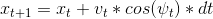
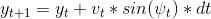
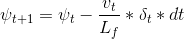
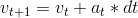
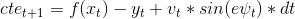
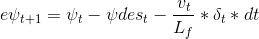
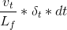
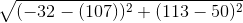

# CarND-Controls-MPC
Self-Driving Car Engineer Nanodegree Program.

Term2 final project: Model Predictive Control

The achieved reference speed is 100MPH. The video record is here:[video](./output/record.mov)

## Basic Build Instructions

1. Clone this repo.
2. Make a build directory: `mkdir build && cd build`
3. Compile: `cmake .. && make`
4. Run it: `./mpc`.

## Implementation

The model uses 6 state variable vector to describe the car in current state:[px, py, psi, v, cte, epsi]
where
px: the car position of x-axis.
py: the car position of y-axis.
psi:the orientation of the vehicle in radiansconverted from the Unity format to the standard format expected in most mathemetical functions.
v: The current velocity of car in mph
cte: the cross track error
epsi: the error orentation compared to ideal situation.

In the main.cpp, upon every websocket message, the car position and waypoints are extracted from the message. Then subtract the car position[px, py] from the waypoint so that move the co-ordinate origin to car position. Then rotates the system by the current car orientation in psi so that in new co-ordinates, ideal desired car orentation is along the x-axis such that the CTE simply becomes the y-axis offset and counter-clock orentatioin is negative PSI(left turn) and clock-wise orentation PSI(right turn).

Here is the pusduo code:

* Step 1: co-ordinate translation
     // do the clock wise PSI rotation
     
    ``` 
     foreach waypoint in waypoints{
       waypoint_x_offset = waypoint[px] - car[px]
       waypoint_y_offset = waypoint[py] - car[py]
       waypoint[px] = waypoint_x_offset * cos(0-psi) - waypoint_y_offset*sin(0-psi))
       waypoint[py] = waypoint_x_offset * sin(0-psi) + waypoint_y_offset*cos(0-psi))
     }
     ```
     
* Step 2: Polyfit the waypoints to find the coeffs
   Simply call the polyfit witht the waypoints from step1 to fit them into polynomial of order of 3.
   
* Step 3: Calcuate the CTE and epsi
   The CTE becomes straightforward by simply apply the polyeval at origin of zero where car is positioned, i.e. polyeval(coeffs, 0)
   The epsi, error orentation is the angle of atan of first derivative of the polynomial at car position, i.e. new origion.
   first derivative(fd1) = coeffs[1] + 2 * px * coeffs[2] + 3 * coeffs * px * px
   since px in new coordinate is of zero, above becomes: fd1 = coeffs[1]
   so the error orentation is epsi = psi - atan(coeffs[1]) = - atan(coeff[1] since PSI desired is of zero to drive along x-axis.
   
* step 4: calcuate the steering angle and throttle using the MPC, such as
      vars = mpc.Solve(state, coeffs)
      
* step 5: normalize the angle to  [ -25, 25] in radias and display the waypoints and projected path to simulator. The actuator is normalized between [-1, 1] when MPC:Solve. no further action is needed.

**FG_eval**: The model update constraint is govened by following fomula in Class FG_eval:

* Cost fg[0] has the cost of various conditions:
     1. CTE of N steps  * cte_weight
     2. epsi of N steps * epsi_weight
     3. speed offset to reference speed(100MPH in the final submission) * v_weight
     4. orentation error * delta_weight
     5. actuation  * a_weight
     6. difference of current orentation and previous orentation error * diff_delta_weight
     7. difference of current actuation and previous actuation * diff_a_weight
     
     The weights are discussed later in model tuning setion.
     
* model state update formula:

     

     
     
     
     
     
     
     
     
     
     
     note the minus sign before  is different from class content. the reason is because that note if δ is positive we rotate counter-clockwise, or turn left. In the simulator however, a positive value implies a right turn and a negative value implies a left turn. Due to this we switch the + sign to - sign.
     
* Constraits
     delta is between [-25, 25] degree
     a is between [-1, 1] for acuation.


### Timestep Length and Elapsed Duration (N & dt)
In order to run speed at 100MPH, every second the travelled distance is about 100 * 1609m/3600s = 45meters.

The waypoints given from simulator is almost a straight line, the euclian distance from the start to end is about 55m.

42["telemetry",{"ptsx":[-32.16173,-43.49173,-61.09,-78.29172,-93.05002,-107.7717],"ptsy":[113.361,105.941,92.88499,78.73102,65.34102,50.57938],"psi_unity":4.12033,"psi":3.733651,"x":-40.62,"y":108.73,"steering_angle":0,"throttle":0,"speed":2.628028}]

distance =  = 55m

so in order to predict the distance by waypoints, we need 55/44 = 1.25s

so if we choose N = 10, then dt = 0.125. This is how I set the N and dt.

or if choose bigger N such as 20, dt = 0.0625. However, the calculation of Jacob and Hassian matrix will take longer time and model is not able to catch up the incoming message processing.

### Polynomial Fitting and MPC Preprocessing
This has been covered in above model implemenation. Step 1 does the preprocessing the waypoints to move the origin or coordinate to car system for the waypoints. Then does the rotation of the waypoints clock wise by PSI. After the rotation is done then use polyfit to fit the new waypoints.
* Step 1: co-ordinate translation
     // do the clock wise PSI rotation
    ``` 
     foreach waypoint in waypoints{
       waypoint_x_offset = waypoint[px] - car[px]
       waypoint_y_offset = waypoint[py] - car[py]
       newwaypoint_x[px] = waypoint_x_offset * cos(0-psi) - waypoint_y_offset*sin(0-psi))
       newwaypoint_y[py] = waypoint_x_offset * sin(0-psi) + waypoint_y_offset*cos(0-psi))
     }
     ```
* Step 2: Polyfit the waypoints to find the coeffs
   Simply call the polyfit witht the waypoints from step1 to fit them into polynomial of order of 3.

 ``` 
    coeffs = polyfit(newwaypoint_x, newwaypoint_y, 3);
 ```


### Model Predictive Control with Latency
Since the simulation model needs 100ms to emulate the acuation latency, so once the model received Json message which means the acuation is done and car is in new state.  the MPC needs to calculate the next new state and PSI and delta using MPC. This calculation time depends on machine and algorithm on how many N and dt. in order to acurately decide how much time was spent in the MPC calculation, use the following psudo code to get time elapse of MPC:

```
     time_t start, end;
     start = time(NULL);
     ... doing all MPC calculation.
     end = time(NULL);
     time_diff = (end - start) * 1000;
     latency = (time_diff > 100 ) ? 0 : int(100 - time_diff);
     this_thread::sleep_for(chrono::milliseconds(latency));
     ws.send(msg.data(), msg.length(), uWS::OpCode::TEXT);
```
Thread sleeps remaining ms before sending new data to simulator. if calculation takes more than 100ms, at the end new actuation is sent immediately.


### model tuning

* weight tuning
initially have following weights for the cost calculation:
cte_weight = 2000
epsi_weight = 2000
v_weight = 1
delta_weight = 5
a_weight = 5
diff_delta_weight = 200
diff_a_weight = 10

this can get model to run around track for reference speed at 40MPH. However, when the reference speed increases, the car seems oscillate on orientation and gets off the track especially on the sharp turns. In order to keep the car on track, purposely increased the cte_weight = 4500 and epsi_weight = 3500 and delta_weight = 600. This can keep car on the track.

However, during simulation run, there is some projected path seems wierd, please see the picture below.

Thought this might be related to the quick speed change. In order to avoid this, add the penalty to the diff_a_weight to 200.

so the final weights are used:
cte_weight = 4500
epsi_weight = 3500
v_weight = 1
delta_weight = 600
a_weight = 2
diff_delta_weight = 100
diff_a_weight = 200

